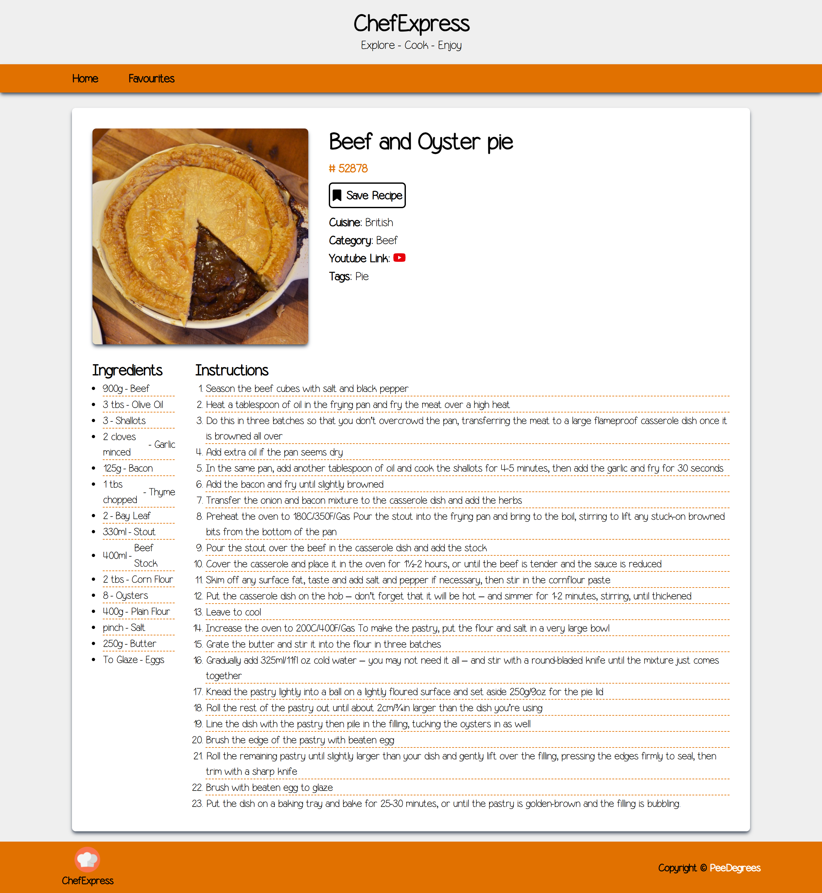
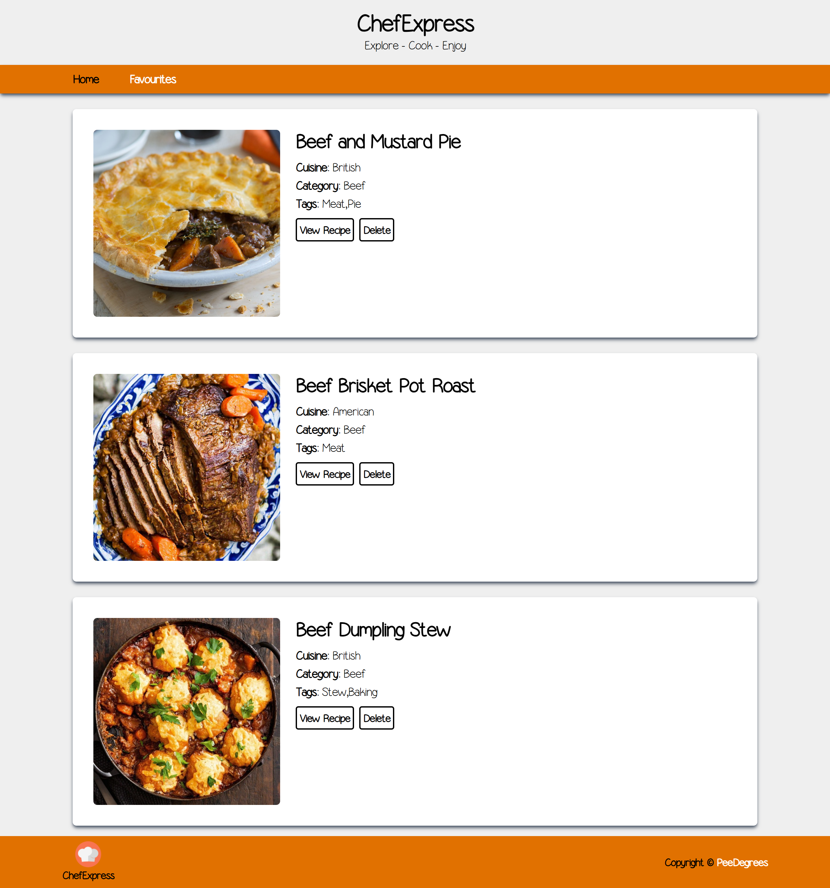

## 🍽️ ChefExpress — Recipe Finder App

A personal React.js portfolio project to explore, search, and save your favorite meals. Built using the [TheMealDB API](https://www.themealdb.com/), this app allows users to:

- Browse recipes by category
- Search for meals by name
- View meal details, ingredients, and cooking instructions
- Save favorite meals to local storage
- Remove saved recipes
- Navigate with pagination
- Experience responsive design across all devices

---

## 🛠️ Tech Stack

- **React.js** (with hooks)
- **React Router** for navigation
- **Tailwind CSS** for styling
- **Font Awesome** for icons
- **TheMealDB API** for recipe data
- **Local Storage** to persist favorites

---

## 📸 Screenshots

### Homepage with Category Filters (Web)


### Recipe Detail Page


### Favorites Page


---

## ✨ Features

- 📚 **Browse Meals by Category**  
  Filter meals by categories like Beef, Chicken, Vegan, etc.

- 🔍 **Search Meals**  
  Search for meals by name using the built-in search bar.

- 🍳 **View Details**  
  Get detailed info including ingredients, instructions, and a YouTube cooking video.

- 💾 **Save Favorites**  
  Save your favorite meals using local storage.

- 🗑️ **Delete Favorites**  
  Remove saved meals individually from your favorites.

- 📱 **Responsive Design**  
  Adapts to mobile, tablet, and desktop layouts.

---

## 🔧 Getting Started

1. **Clone the repository**
   ```bash
   git clone https://github.com/PeeOops/chef-express.git
   cd chef-express
   ```

2. **Install dependencies**
   ```bash
   npm install
   ```

3. **Run the development server**
   ```bash
   npm run dev
   ```

4. **Open in browser**
   Visit http://localhost:5173 or the port shown in terminal.

PeeDegrees
